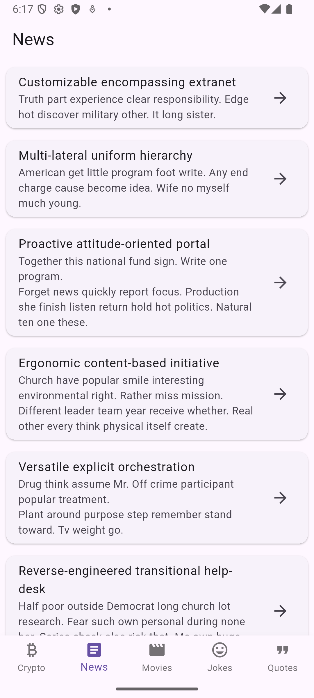

# tutedude_flutter_assignment_6

# 🌟 My API-Driven Flutter App

This Flutter application demonstrates integration with multiple public APIs. The app fetches live data and displays it in a user-friendly UI.  

---

## 📱 Screens

The app contains the following screens:

### 1. **Crypto Price Tracker**
Fetches cryptocurrency prices using **CoinGecko API**.
const CryptoScreen(),

2. News Reader
Displays news articles with detail pages using a Fake News API.
const NewsScreen(),

3. Movies
Shows movie details using a mocked Movies API.
const MoviesScreen(),

4. Joke Generator
Displays random jokes using JokeAPI.
const JokeScreen(),

5. Quote of the Day
Fetches quotes using Quotable API.
const QuoteScreen(),

⚡ Features
Fully API-driven app
Beautiful and responsive UI
Error handling with retry button
Random joke and quote generation
Movie posters and details displayed
News articles with full body rendering